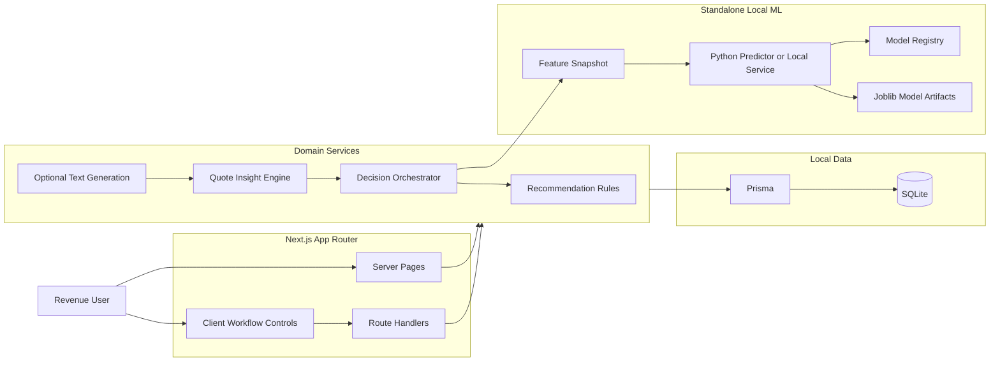

# AI Renewal Quote Copilot

AI Renewal Quote Copilot is a standalone revenue transformation demo for enterprise SaaS revenue teams. It shows how deterministic pricing policy, local open-source ML models, GenAI narrative generation, quote insight automation, and human approval workflows combine into one auditable renewal decision system.

The current default experience is **ML-Assisted Rules**: rules remain the policy system of record, a local ML model influences renewal risk scoring, pricing guardrails remain final, and every workflow run leaves auditable decision evidence.

---

## The Business Problem

Enterprise SaaS renewal decisions are still mostly manual, even when the company has CRM, CPQ, subscription, usage, support, pricing, and finance data. The issue is not just data availability. The issue is that renewal teams must interpret many signals, reason through commercial trade-offs, prepare quote actions, justify decisions, and route approvals under time pressure.

That creates several compounding problems:

- Risk signals are scattered across systems and reviewed inconsistently.
- Pricing and discount decisions depend too much on manual judgment.
- Expansion, retention, concession, and escalation opportunities are easy to miss.
- Quote changes are hard to explain after the fact.
- Deal desk and finance reviewers do not always receive a clear audit trail.
- AI-generated narratives, if used alone, are not sufficient — pricing decisions require governed rules, model evidence, and human approval.

---

## How This App Solves It

AI Renewal Quote Copilot demonstrates an AI-native renewal workflow backed by deterministic rules, local ML models, GenAI narrative generation, and human approval. The app applies AI and ML in three distinct ways:

**ML models score renewal risk and expansion propensity** using structured account, subscription, usage, support, pricing, payment, and adoption features. The app includes local open-source model artifacts, model registry metadata, evaluation reports, and a standalone prediction path.

**Deterministic AI decision orchestration combines rules and ML evidence** to produce governed renewal recommendations. In ML-Assisted Rules mode, the rule engine remains the policy system of record while ML risk evidence influences the final recommendation score.

**GenAI generates reviewer-ready explanations** for recommendations, quote insights, approval briefs, and executive summaries. Prompt inputs, fallback behavior, and generated narratives remain visible for audit.

The result is a complete renewal decision workflow:

- A renewal case is evaluated using rules plus local ML evidence.
- Quote insights convert recommendation outputs into structured quote actions.
- Scenario Studio generates read-only commercial alternatives for comparison.
- Quote Review Center keeps final approval human-controlled.
- Decision Trace shows rule output, ML output, final recommendation, guardrails, model metadata, and the evidence used.
- AI Architecture and Settings expose model readiness, registry approval, evaluation metrics, serving mode, and runtime recommendation mode.

This makes the app more than a UI demo. It is a standalone AI/ML-backed renewal decision system that shows how enterprise teams can combine predictive ML, GenAI explanation, deterministic guardrails, and human review in one auditable workflow.

---
## The Renewal Command Center in Action


## Product Workflow

```text
Settings
  -> choose Recommendation Mode and confirm ML readiness

Policy Studio
  -> inspect rules, worked examples, prompts, and ML-assisted behavior

Renewal Subscriptions
  -> review baseline subscription and signal context

Renewal Command Center
  -> follow the guided flow: Run Workflow, Review Changes, Apply Quote Actions, Inspect Evidence, Finalize Review
  -> inspect Decision Trace, ML output, guardrails, prompts, and reasoning when needed

Scenario Studio
  -> choose cases from an index with scenario counts
  -> compare generated commercial alternatives

Quote Review Center
  -> review applied quote actions and record the final quote decision
```

---

## Recommendation Modes

| Mode | UI Label | Behavior |
| --- | --- | --- |
| `RULES_ONLY` | Rules Only | Deterministic recommendation engine is final. ML is not called. |
| `ML_SHADOW` | Shadow Mode | ML scores are captured for audit and comparison. Rules remain final. |
| `HYBRID_RULES_ML` | ML-Assisted Rules | Rule risk and ML risk are blended for the recommendation. Pricing guardrails remain final. |

The app defaults to `HYBRID_RULES_ML` when no runtime setting is present. Runtime changes are made from `Settings` by selecting a mode and clicking `Apply ML Mode`.

---

## How Recommendations Are Calculated

1. The rule engine scores each renewal line from structured signals: usage, active users, login trend, support tickets, Sev1 incidents, CSAT, payment risk, adoption band, current ARR, discount, and pricing policy.
2. The rule engine assigns a line disposition — renew, expand, renew with concession, or escalate.
3. Pricing guardrails calculate proposed quantity, discount, net unit price, ARR impact, and approval requirements.
4. If ML is enabled, the app builds a versioned feature snapshot and calls the local ML predictor.
5. In ML-Assisted Rules mode, each item risk score is blended as `70% rule risk + 30% ML risk`.
6. The final bundle recommendation is recalculated from the effective item risk scores.
7. Decision Trace records the rule baseline, feature snapshot, ML output, final output, guardrails, model version, policy version, and feature schema.

More detail: [AI Architecture](docs/technical-architecture.md)

---

## How Quote Insights Are Calculated

Quote insights are generated after recommendation recalculation. They are not free-form suggestions.

1. Each recommendation line is mapped to a quote insight type.
2. The insight engine carries forward line disposition, risk, proposed quantity, proposed price, discount, ARR delta, scenario, signal snapshot, and ML evidence when available.
3. Objective scoring classifies the business goal: retain revenue, protect margin, grow account, or govern risk.
4. Additive insights may be generated for eligible cross-sell or expansion motions.
5. Existing quote actions already added to the quote are preserved.
6. Suggested insights are diffed against the prior generation so the UI can show added, removed, or modified actions.
7. Optional LLM or deterministic local rationale generation produces reviewer-facing narrative, but structured evidence remains the source of truth.

---

## Architecture



---

## Local ML Models

The repo includes a standalone ML bundle under `ml/`.

| Task | Active Model | Framework | Selection Criterion |
| --- | --- | --- | --- |
| Renewal risk | `renewal_risk_xgboost` | XGBoost | Lowest holdout MAE |
| Expansion propensity | `expansion_propensity_sklearn` | scikit-learn | Highest holdout ROC AUC |

Supporting artifacts:

- `ml/synthetic_data.py` — generates the local synthetic training dataset.
- `ml/train.py` — trains runtime artifacts.
- `ml/evaluate.py` — evaluates baseline and challenger candidates.
- `ml/predict.py` — stdin/stdout prediction interface used by Next.js.
- `ml/serve.py` — optional local HTTP model service.
- `ml/model-registry.json` — active model metadata, approvals, checksums, and metrics.
- `ml/MODEL_CARD.md` — model intent, limitations, and promotion requirements.

The current data is synthetic and generated from the application data model. It is suitable for standalone demo readiness and integration validation, not production predictive claims.

---

## Seeded Demo Data

First-run seed data is designed for a complete standalone walkthrough:

- Every renewal case has a baseline quote aligned to the renewal case.
- Scenario quote artifacts are materialized for eligible cases and shown in the Scenario Studio index.
- Scenario Studio shows per-case scenario counts before the user opens a case.
- The baseline quote remains the editable execution source; scenario quotes are read-only comparison artifacts.
- Default Recommendation Mode is ML-Assisted Rules.

---

## Tech Stack

- Next.js 15 App Router
- React 18
- TypeScript strict mode
- Prisma ORM
- SQLite local database
- Python ML runtime
- scikit-learn and XGBoost model artifacts
- Playwright E2E tests

---

## Quickstart

### Prerequisites

- Node.js `>=20`
- npm
- Python 3.11 recommended for ML setup

### One-command standalone setup

```bash
make standalone
npm run dev
```

Open `http://localhost:3000`.

### Manual setup

```bash
npm install
cp .env.example .env
npm run db:setup
make install-ml
npm run ml:generate-data
npm run ml:train
npm run ml:evaluate
npm run dev
```

---

## Optional Local ML Service

By default, Next.js invokes `ml/predict.py` as a local subprocess. To demonstrate a production-shaped model-serving boundary:

```bash
npm run ml:serve
```

Then set:

```bash
ML_SERVICE_URL=http://127.0.0.1:8010
```

If `ML_SERVICE_URL` is not set, the app uses subprocess prediction.

---

## Environment Variables

| Variable | Required | Default | Purpose |
| --- | --- | --- | --- |
| `DATABASE_URL` | Yes | `file:./dev.db` | Local SQLite database. |
| `ML_RECOMMENDATION_MODE` | No | `HYBRID_RULES_ML` | Default recommendation mode before runtime setting is saved. |
| `ML_PYTHON_BIN` | No | `.venv-ml/bin/python` | Python executable used for local prediction. |
| `ML_SERVICE_URL` | No | empty | Optional local HTTP ML service URL. |
| `AI_PROVIDER` | No | `ollama` | Text generation provider. Ollama is the local default; set to `openai` for hosted OpenAI generation. |
| `OPENAI_API_KEY` | No | empty | Enables hosted OpenAI text generation when `AI_PROVIDER=openai`. Not needed for Ollama. |
| `OPENAI_MODEL` | No | `gpt-5.3` | OpenAI text generation model label. |
| `OLLAMA_BASE_URL` | No | `http://localhost:11434/v1` | Local Ollama OpenAI-compatible endpoint. |
| `OLLAMA_MODEL` | No | `llama3.1` | Ollama model label used when `AI_PROVIDER=ollama`. |
| `OPENAI_MOCK_MODE` | No | `0` | Forces deterministic mock AI text output when enabled. |

---

## Scripts

| Command | What it does |
| --- | --- |
| `npm run dev` | Start the local Next.js server. |
| `npm run build` | Build the production app. |
| `npm run lint` | Run lint checks. |
| `npm run db:setup` | Generate Prisma client, push schema, and seed data. |
| `npm run db:reset` | Force-reset schema and reseed. |
| `npm run db:reset:clean` | Remove local DB and rebuild from seed. |
| `npm run ml:generate-data` | Generate synthetic ML training data. |
| `npm run ml:train` | Train local ML artifacts. |
| `npm run ml:evaluate` | Evaluate model candidates and update reports. |
| `npm run ml:predict` | Run stdin/stdout predictor. |
| `npm run ml:serve` | Start optional local ML prediction service. |
| `npm run test:scenario:coverage` | Validate scenario generation coverage. |
| `npm run test:e2e` | Run Playwright tests. |
| `npm run test:e2e:contracts` | Run workflow and traceability regression subset. |
| `make standalone` | Install Node/Python dependencies, seed DB, train/evaluate ML, and lint. |
| `make smoke-standalone` | Regenerate ML artifacts and run TypeScript/lint checks. |

---

## Documentation

- [User Guide with Screenshots](docs/user-guide-renewal-workflow.md)
- [AI Architecture](docs/technical-architecture.md)
- [Technical Review Notes](docs/technical-review-ai-ml.md)
- [ML Model Card](ml/MODEL_CARD.md)
- [ML README](ml/README.md)

---

## Demo Notes

For a technical review, start with:

1. **Settings** — show Recommendation Mode and ML readiness.
2. **AI Architecture** — show model selection, metrics, registry, and serving boundary.
3. **Renewal Command Center** — run the workflow and inspect Decision Trace.
4. **Quote Insights** — show structured evidence and ML metadata.
5. **Quote Review Center** — show human approval and final quote decision.

---

## Troubleshooting

If the dev server shows a stale chunk error after a production build:

```bash
rm -rf .next
npm run dev
```

If local data looks inconsistent:

```bash
npm run db:reset:clean
```

If ML prediction is unavailable:

```bash
make install-ml
npm run ml:generate-data
npm run ml:train
npm run ml:evaluate
```
