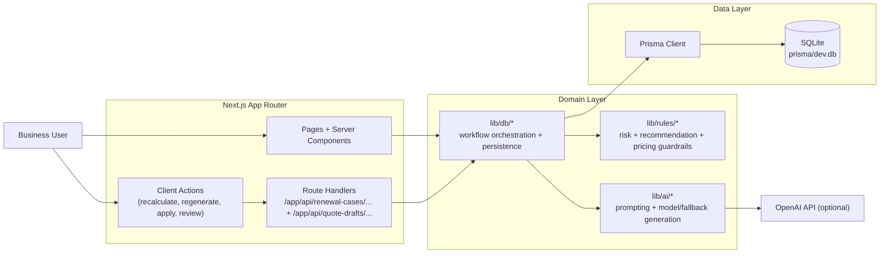

# AI Renewal Quote Copilot

AI-powered renewal management and pricing optimization workflow for enterprise SaaS teams.  
This application uses **Artificial Intelligence (AI), agentic workflows, and decision intelligence** to transform subscription and account signals into **automated renewal recommendations, CPQ-ready quotes, and explainable pricing insights**.

> Keywords: AI for SaaS renewals, subscription revenue optimization, pricing intelligence, CPQ automation, ARR growth, renewal management AI

[](https://nextjs.org/)
[](https://www.typescriptlang.org/)
[](https://www.prisma.io/)
[](https://www.sqlite.org/)
[](https://playwright.dev/)

---

## 🚀 AI Use Case: Subscription Renewal & Pricing Intelligence

This project demonstrates how **AI can be applied to SaaS revenue operations (RevOps)** to:

- automate subscription renewal decision-making  
- optimize pricing and discounting strategies  
- generate CPQ (Configure Price Quote) ready outputs  
- improve customer retention and expansion  
- increase Annual Recurring Revenue (ARR)  

---

## Business Problem

Modern SaaS companies rely on **subscription revenue models**, but renewal operations remain:

- manual and reactive  
- disconnected from pricing intelligence  
- difficult to scale  

This leads to:

- missed or delayed renewals  
- inconsistent pricing and discounting  
- revenue leakage  
- lower retention and expansion rates  

As subscription portfolios scale, these inefficiencies directly impact:

👉 **ARR growth, net revenue retention (NRR), and profitability**

---

## Proposed Solution: AI Renewal & Pricing Workflow

The **AI Renewal Quote Copilot** introduces an **AI-driven, agentic workflow** for renewal and pricing automation.

### Core AI capabilities

- 🤖 **AI-powered renewal recommendations** (risk, expansion, concession)
- 💰 **Dynamic pricing and discount optimization**
- 📊 **Subscription intelligence using account + usage signals**
- 🧾 **Automated CPQ / quote generation**
- 🔍 **Explainable AI decisions with full traceability**
- 🔁 **Human-in-the-loop approval workflows**

### Business outcomes

- increase ARR and Net Revenue Retention (NRR)  
- reduce revenue leakage  
- improve pricing consistency  
- scale renewal operations with AI automation  

---

## 🔑 Key AI Concepts in this Project

- **Agentic AI Workflow** – multi-step AI + rules orchestration  
- **Decision Intelligence** – AI-driven recommendations with business context  
- **Pricing Optimization** – AI-guided discount and contract strategies  
- **CPQ Automation** – generating quote-ready outputs  
- **Explainable AI (XAI)** – transparent reasoning behind recommendations  


## Product surfaces

- `Dashboard` (`/`): queue-level visibility and attention cases
- `Renewal Subscriptions` (`/renewal-cases?view=list`): baseline subscription list grouped by account
- `Case Decision Board` (`/renewal-cases`): actionable renewal case storyboard grouped by storyline lane
- `Case Decision Board (Case Workspace)` (`/renewal-cases/[caseId]`): scenario selection, AI workflow run, quote insights, and review context
- `Scenario Quotes` (`/scenario-quotes`): dedicated case index for baseline-vs-scenario comparison
- `Scenario Quotes (Case Workspace)` (`/scenario-quotes/[caseId]`): compare read-only scenario quotes and mark preferred option
- `Quote Draft Board` (`/quote-drafts`): baseline quote execution board with status, approval posture, and scenario-count cues
- `Quote Draft Detail` (`/quote-drafts/[quoteDraftId]`): line-level commercial deltas and quote-level decision actions
- `Policy Studio` (`/policies`): read-only recommendation and insight rules with worked examples
- `Settings` (`/settings`): environment and model readiness checks
- `README Preview` (`/readme-preview`): internal markdown preview utility for documentation checks

## End-to-end workflow

```text
Policy Studio (optional, reference)
  -> Renewal Subscriptions
    -> Case Decision Board
      -> Run End-to-End AI workflow (or manual step-by-step mutations)
      -> Apply selected Quote Insights to Baseline Quote
        -> Scenario Quotes (auto-generate/regenerate, compare, mark preferred)
          -> Quote Draft Board (review and approve/reject quote)
```

## Architecture



ASCII fallback:

```text
+--------------------+
| Business User      |
+--------------------+
          |
          v
+----------------------------------------------+
| Next.js App Router                            |
| - Pages + Server Components                   |
| - Client Actions                              |
| - Route Handlers (/app/api/renewal-cases/... + /app/api/quote-drafts/...) |
+----------------------------------------------+
          |
          v
+----------------------------------------------+
| Domain Layer                                  |
| - lib/db    (workflow orchestration)          |
| - lib/rules (risk + recommendations)          |
| - lib/ai    (AI generation + fallback)        |
+----------------------------------------------+
      |                           |
      v                           v
+---------------------+      +----------------------+
| Prisma Client       |      | OpenAI API (optional)|
+---------------------+      +----------------------+
      |
      v
+---------------------+
| SQLite (prisma/dev.db) |
+---------------------+
```

## Tech stack

- Next.js 15 (App Router)
- TypeScript (strict mode)
- Prisma + SQLite
- Playwright (E2E)

## Quickstart

### Prerequisites

- Node.js `>=20`
- npm

### Run locally

```bash
npm install
cp .env.example .env
npm run db:setup
npm run dev
```

Open:

- `http://localhost:3000`
- if `3000` is already used, Next.js will auto-fallback (usually `http://localhost:3001`)

## User guide (with screenshots)

- End-to-end walkthrough using `RC-ACCT-1016`:
  - [`docs/user-guide-renewal-workflow.md`](docs/user-guide-renewal-workflow.md)

## Environment variables

| Variable | Required | Default | Purpose |
| --- | --- | --- | --- |
| `DATABASE_URL` | Yes | `file:./dev.db` | Local SQLite database |
| `OPENAI_API_KEY` | No | empty | Enable live OpenAI generation |
| `OPENAI_MODEL` | No | `gpt-5.3` | Model used when API key is set |
| `OPENAI_MOCK_MODE` | No | `0` | Force deterministic mock AI outputs (`1/true/yes/on`) |

AI execution modes:

- `OPENAI_MOCK_MODE=1`: deterministic mock path through the same generation workflow
- no API key + mock mode off: deterministic fallback text
- API key present + mock mode off: live OpenAI calls

## Scripts

| Command | What it does |
| --- | --- |
| `npm run dev` | Start local dev server |
| `npm run build` | Production build |
| `npm run start` | Start production server |
| `npm run lint` | Run Next/ESLint checks |
| `npm run db:generate` | Generate Prisma client |
| `npm run db:push` | Push Prisma schema |
| `npm run db:seed` | Seed local data |
| `npm run db:setup` | Generate + push + seed |
| `npm run db:reset` | Force reset DB then seed |
| `npm run db:reset:clean` | Remove local DB then validate/generate/push/seed |
| `npm run db:studio` | Open Prisma Studio |
| `npm run app:reset:run` | Validate DB setup then run app |
| `npm run app:smoke` | Curl-based smoke checks |
| `npm run test:scenario:coverage` | Validate baseline + scenario generation coverage across all seeded cases |
| `npm run test:e2e` | Playwright full E2E test suite |
| `npm run test:e2e:contracts` | Contracts/regression subset for workflow and traceability |
| `npm run test:e2e:ui` | Playwright interactive UI mode |
| `npm run test:e2e:headed` | Playwright headed browser mode |
| `npm run test:e2e:debug` | Playwright debug mode |

## Testing

```bash
# quick route smoke checks
npm run app:smoke

# baseline/scenario data integrity check across all seeded cases
npm run test:scenario:coverage

# contract/regression suite used as main quality gate
npm run test:e2e:contracts

# full E2E suite
npm run test:e2e
```

If tests fail due to dirty scenario state, reseed and rerun:

```bash
npm run db:reset:clean
npm run test:e2e
```

## API surface

- `POST /api/quote-drafts/[quoteDraftId]/review`
- `POST /api/renewal-cases/[caseId]/generate-ai`
- `POST /api/renewal-cases/[caseId]/generate-quote-scenarios`
- `POST /api/renewal-cases/[caseId]/preferred-quote-scenario`
- `POST /api/renewal-cases/[caseId]/quote-insights/[quoteInsightId]/add-to-quote`
- `POST /api/renewal-cases/[caseId]/recalculate`
- `POST /api/renewal-cases/[caseId]/recalculate-quote-insights`
- `POST /api/renewal-cases/[caseId]/regenerate-insights-ai`
- `POST /api/renewal-cases/[caseId]/review`
- `POST /api/renewal-cases/[caseId]/scenario`

## Repository structure

```text
app/                     Next.js routes + API handlers
components/              UI components by feature
lib/
  ai/                    AI orchestration, prompts, fallback
  db/                    Query/mutation workflow orchestration
  rules/                 Deterministic scoring/recommendation logic
  format/                Formatting helpers
  policies/              Rule references and worked examples
prisma/
  schema.prisma          Data model
  seed.ts                Seed loader
  seed-data/             Synthetic seed data
tests/                   Playwright end-to-end specs
scripts/                 DB reset and smoke automation scripts
docs/                    Product, data model, and scaffold notes
```

## GitHub upload checklist

Before pushing:

1. Confirm local env files are not committed (`.env` is ignored).
2. Run `npm run db:setup`.
3. Run `npm run test:scenario:coverage` and `npm run test:e2e:contracts` (or at minimum `npm run app:smoke`).
4. Verify README links/routes are correct.
5. Push with a clean root (no local artifacts).

## Notes

- Data is synthetic and intended for local development/testing.
- This project is intentionally focused on decision intelligence and reviewer workflow, not production-grade multi-tenant integration hardening.
