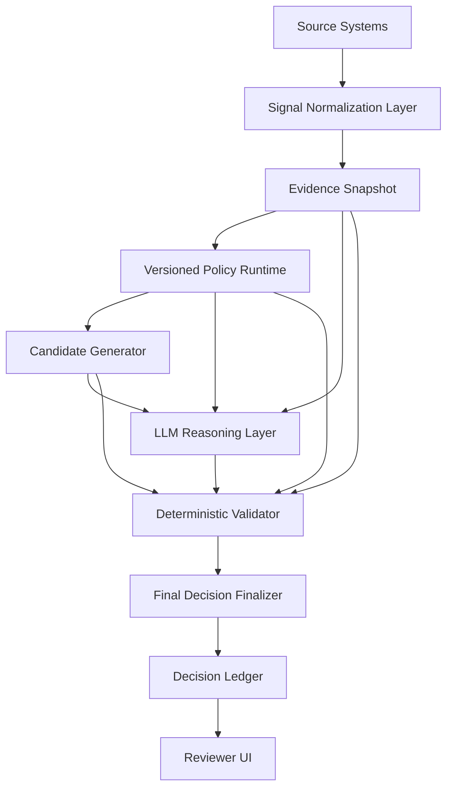

# LLM-Guarded Decisioning Project Plan

## Purpose

This plan defines how to evolve the renewal recommendation and quote insight engines from coded demo logic into an enterprise-grade decisioning platform that can use dynamic subscription insights and LLM reasoning safely.

The target design is:

> Dynamic evidence feeds deterministic policy. Deterministic engines produce valid candidates. The LLM reasons over those candidates. A deterministic validator accepts, adjusts, or rejects the LLM proposal. Final outputs are persisted with full audit lineage.

## Design Principles

- Deterministic policy remains the final authority for eligibility, pricing math, guardrails, approval routing, and persistence.
- LLMs are used for reasoning, ranking, critique, explanation, and structured proposal generation.
- LLMs may influence selected candidates only inside a bounded decision envelope.
- Every decision must be replayable from stored evidence, policy version, model version, prompt version, candidates, LLM proposal, validator result, and final output.
- Dynamic subscription insights must be modeled as versioned evidence, not hardcoded demo fields.
- Invalid or unsupported LLM output must fall back to the deterministic winner.

## Target Runtime Flow

## Operating Modes

| Mode | Purpose | Final Authority |
| --- | --- | --- |
| `RULES_ONLY` | Deterministic recommendation and quote insight generation. | Rules and policy |
| `RULES_ML` | Rules plus ML risk and expansion evidence. | Rules and policy |
| `LLM_CRITIC_SHADOW` | LLM reviews deterministic outputs and flags risks/missing evidence. | Rules and policy |
| `LLM_RANKING_SHADOW` | LLM ranks generated candidates, but output does not affect final decision. | Rules and policy |
| `LLM_ASSISTED_GUARDED` | LLM can select among allowed candidates when validator passes. | Validator and policy |
| `HUMAN_APPROVAL_REQUIRED` | LLM reasoning supports reviewer decision for high-risk or exception cases. | Human reviewer plus policy |

## Phase 1: Dynamic Evidence Foundation

Goal: prepare the app to consume production-like subscription insights as dynamic evidence.

- [x] Define `SignalDefinition` model.
  - Stores signal key, label, data type, unit, valid range, freshness rules, and source category.
  - Examples: `usage_percent`, `active_user_percent`, `ticket_count_90d`, `payment_risk_band`, `support_burden_score`.
- [x] Define `SignalObservation` model.
  - Stores subject type, subject ID, signal key, value, observed date, source system, confidence, and lineage metadata.
- [x] Define `EvidenceSnapshot` model.
  - Stores the frozen set of signals used for a decision run.
  - Includes missing data, stale data, and source quality metadata.
- [x] Build evidence snapshot generator.
  - Converts current account, subscription, metric, pricing, and quote state into normalized evidence.
  - Supports both seeded data and future external source data.
- [x] Add evidence quality scoring.
  - Computes freshness, completeness, confidence, and source reliability.
- [x] Add UI/debug view for evidence snapshots.
  - Shows technical users what evidence was used and which signals were missing or stale.

Acceptance criteria:

- [x] A renewal case can produce a versioned evidence snapshot without running the full recommendation workflow.
- [x] Evidence snapshot is persisted and linked to `DecisionRun`.
- [x] Missing and stale signals are visible in the technical decision trace.

## Phase 2: Versioned Policy Runtime

Goal: move business thresholds and eligibility rules toward versioned policy artifacts.

- [x] Define policy artifact types.
  - Risk scoring policy.
  - Disposition eligibility policy.
  - Pricing guardrail policy.
  - Approval routing policy.
  - Quote insight mapping policy.
  - Scenario generation policy.
  - LLM validation policy.
- [x] Create policy registry.
  - Stores active policy IDs and versions.
  - Supports side-by-side old/new policy comparison later.
- [x] Refactor coded thresholds into policy-readable configuration where practical.
  - Keep deterministic execution in TypeScript.
  - Avoid moving complex logic into unsafe free-form expressions.
- [x] Add policy evaluation trace.
  - Records which policy rules fired and why.
- [x] Add policy test fixtures.
  - Fixtures should cover low risk, high risk, expansion, concession, escalation, margin recovery, and approval cases.

Acceptance criteria:

- [x] Recommendation workflow records policy version IDs in every decision run.
- [x] Rule hits and guardrail outcomes are traceable to named policy artifacts.
- [x] Existing deterministic behavior remains unchanged unless explicitly updated.

## Phase 3: Candidate Generation Layer

Goal: generate a safe decision envelope before involving the LLM.

- [x] Define `DecisionCandidate` contract.
  - Candidate type, eligibility status, score, reason codes, supporting evidence references, blocked reason, and policy references.
- [x] Generate recommendation candidates.
  - Examples: `RENEW_AS_IS`, `CONTROLLED_UPLIFT`, `RENEW_WITH_CONCESSION`, `DEFENSIVE_RENEWAL`, `EXPAND`, `ESCALATE`.
- [x] Generate quote insight candidates.
  - Examples: `RENEW_AS_IS`, `CONCESSION`, `MARGIN_RECOVERY`, `EXPANSION`, `CROSS_SELL`, `HYBRID_DEPLOYMENT_FIT`, `APPROVAL_WARNING`.
- [x] Mark candidates as `ALLOWED`, `BLOCKED`, or `REQUIRES_APPROVAL`.
- [x] Persist candidates to the decision ledger.
- [x] Show candidates in technical review UI.

Acceptance criteria:

- [x] Every recommendation has at least one deterministic winner and a list of evaluated candidates.
- [x] Blocked candidates include a clear policy reason.
- [x] LLM prompts can be built from candidates without giving the LLM open-ended action authority.

## Phase 4: LLM Critic Shadow Mode

Goal: use LLM reasoning safely without changing final outputs.

- [x] Define `LlmCritique` schema.
  - Decision quality, contradictions, missing evidence, reviewer questions, risk narrative, commercial tradeoffs, and evidence references.
- [x] Create critic prompt template.
  - Inputs: evidence snapshot, deterministic winner, policy hits, quote insights, approval state.
  - Output: strict JSON only.
- [x] Add schema validation for critique output.
- [x] Persist critique output and validation result.
- [x] Add UI panel for decision quality check.
  - Clearly label as advisory and non-authoritative.

Acceptance criteria:

- [x] LLM critique can run in shadow mode with no changes to recommendation or quote outputs.
- [x] Invalid critique output is safely ignored and logged.
- [x] Reviewer can see missing evidence and decision tradeoffs in a structured format.

## Phase 5: LLM Candidate Ranking Shadow Mode

Goal: let the LLM rank allowed candidates while final output remains deterministic.

- [x] Define `LlmCandidateRanking` schema.
  - Ranked candidates, selected candidate, confidence, reason codes, evidence references, and reviewer narrative.
- [x] Create ranking prompt template.
  - Inputs: allowed candidates, blocked candidates with reasons, evidence snapshot, policy summary.
  - Output: strict JSON only.
- [x] Add ranking validator.
  - Ensures selected candidate is in allowed candidates.
  - Ensures evidence references exist.
  - Ensures reason codes are valid.
- [x] Persist LLM ranking and validator result.
- [x] Add comparison UI.
  - Shows rule winner vs LLM preferred candidate in shadow mode.

Acceptance criteria:

- [x] LLM ranking can be compared to deterministic winner.
- [x] LLM ranking cannot affect final state in this phase.
- [x] Validator records pass/fail reasons for each LLM ranking.

## Phase 6: Deterministic Validator

Goal: create the hard gate that allows guarded LLM influence later.

- [x] Define `ValidationResult` contract.
  - Status, accepted candidate, fallback candidate, fallback used, approval required, checks, rejection reasons.
- [x] Implement schema validation.
  - Required fields, enum values, no unsupported fields, confidence range.
- [x] Implement candidate validation.
  - Selected candidate must be allowed.
  - Blocked candidates cannot be selected.
- [x] Implement evidence validation.
  - All cited evidence refs must exist in the evidence snapshot.
  - Evidence must not be stale when the selected candidate requires current data.
- [x] Implement policy validation.
  - Expansion threshold checks.
  - Risk threshold checks.
  - Payment risk checks.
  - Support escalation checks.
  - Pricing guardrail checks.
  - Approval routing checks.
- [x] Implement numeric recalculation.
  - Recompute net unit price, line amount, discount, ARR delta, quote totals.
  - Reject or override LLM-provided numbers when mismatched.
- [x] Implement confidence capping.
  - Cap LLM confidence based on missing data, stale data, rule disagreement, and low evidence quality.
- [x] Add validator test suite.
  - Covers pass, blocked candidate, unsupported evidence, bad enum, invalid discount, stale evidence, and fallback behavior.

Acceptance criteria:

- [x] Validator has deterministic unit tests for each check.
- [x] Validator output is persisted with every LLM proposal.
- [x] Failed validation always falls back to deterministic output.

## Phase 7: LLM-Assisted Guarded Recommendation

Goal: allow LLM selection among valid recommendation candidates when validation passes.

- [x] Add `LLM_ASSISTED_GUARDED` mode.
- [x] Wire candidate ranking output into validator.
- [x] Finalizer chooses:
  - validator accepted candidate when passed
  - deterministic winner when rejected
- [x] Persist rule winner, LLM proposal, validator result, and final candidate.
- [x] Add UI indicators.
  - `Rule winner`
  - `LLM selected`
  - `Validator accepted/rejected`
  - `Final recommendation`
- [x] Add fallback messaging.
  - Explain why deterministic fallback was used when validation fails.

Acceptance criteria:

- [x] Guarded mode can change final recommendation only when validator passes.
- [x] Guarded mode never bypasses approval, pricing, or product catalog guardrails.
- [x] Full decision lineage is visible in technical review.

## Phase 8: LLM-Assisted Guarded Quote Insights

Goal: allow LLM to rank and explain quote insight candidates while deterministic quote math remains final.

- [x] Generate quote insight candidates from recommendation output and policy.
- [x] Let LLM rank and explain insight candidates.
- [x] Validate selected quote insight candidates.
  - Insight type must be allowed.
  - Product must exist in catalog.
  - Pricing and quantity must be recomputed.
  - Approval routing must be deterministic.
- [x] Persist accepted/rejected LLM quote insight proposal.
- [x] Add UI trace for quote insight selection.
  - Rule candidate.
  - LLM rationale.
  - Validator checks.
  - Final insight.

Acceptance criteria:

- [x] LLM can influence insight prioritization only when validator passes.
- [x] Quote draft lines and scenario quote lines are still computed deterministically.
- [x] LLM cannot invent unsupported product, price, or quote line changes.

## Phase 9: Decision Ledger and Audit UI

Goal: make the system explainable and production-auditable.

- [x] Extend `DecisionRun` or add linked ledger tables for:
  - evidence snapshot
  - policy versions
  - model versions
  - prompt versions
  - candidate list
  - LLM proposal
  - validation result
  - final output
  - reviewer decision
- [x] Add replay metadata.
  - Enough metadata to rerun the deterministic parts later.
- [x] Add audit export view.
  - JSON export for a full decision packet.
- [x] Add technical UI panels.
  - Evidence.
  - Candidates.
  - LLM proposal.
  - Validator result.
  - Final decision.

Acceptance criteria:

- [x] A reviewer can explain exactly why a final decision was made.
- [x] A technical user can inspect all inputs and intermediate outputs.
- [x] No final state depends on an unpersisted prompt or transient LLM response.

## Phase 10: Production Readiness

Goal: prepare the architecture for enterprise SaaS operation.

- [x] Add telemetry.
  - LLM pass rate, validation rejection rate, fallback rate, average confidence, stale evidence rate.
- [x] Add governance dashboard.
  - Prompt versions, policy versions, validator failures, mode adoption.
- [x] Add role-based controls.
  - Who can enable guarded mode.
  - Who can approve policy changes.
  - Who can view raw prompt/evidence payloads.
- [x] Add drift and quality monitoring.
  - Evidence distribution drift.
  - ML score drift.
  - LLM disagreement rate.
  - Reviewer override rate.
- [x] Add release gates.
  - Shadow mode required before guarded mode.
  - Minimum pass-rate thresholds.
  - Human approval for exception categories.

Acceptance criteria:

- [x] Guarded mode can be enabled by tenant, environment, or user role.
- [x] Production monitoring can detect when LLM proposals are being rejected too often.
- [x] Policy and prompt changes are versioned and reviewable.

## Suggested Execution Order

1. Phase 1: Dynamic Evidence Foundation.
2. Phase 2: Versioned Policy Runtime.
3. Phase 3: Candidate Generation Layer.
4. Phase 6: Deterministic Validator.
5. Phase 4: LLM Critic Shadow Mode.
6. Phase 5: LLM Candidate Ranking Shadow Mode.
7. Phase 7: LLM-Assisted Guarded Recommendation.
8. Phase 8: LLM-Assisted Guarded Quote Insights.
9. Phase 9: Decision Ledger and Audit UI.
10. Phase 10: Production Readiness.

The validator is intentionally implemented before guarded mode. The LLM can be added in shadow mode earlier, but it should not influence final recommendation or quote insight outputs until the validator is complete.

## Near-Term First Slice

Recommended first implementation slice:

- [x] Add evidence snapshot data contract.
- [x] Generate evidence snapshot from existing seeded renewal data.
- [x] Persist evidence snapshot on `DecisionRun`.
- [x] Show evidence snapshot in technical review.
- [x] Add tests for missing/stale evidence behavior.

This gives the project a production-shaped foundation without changing current recommendation behavior.

## Implementation Progress

### 2026-04-30

Implemented the first guarded-decisioning foundation slice without changing final recommendation behavior:

- Added versioned `RenewalEvidenceSnapshot` generation from existing account, subscription, telemetry, commercial, rule, and final-output data.
- Added evidence quality scoring with signal count, completeness, confidence, missing count, and stale count.
- Extended `DecisionRun` with persisted audit payloads for evidence snapshots, decision candidates, optional LLM proposal, and validator results.
- Added a recommendation `DecisionCandidate` envelope with allowed and blocked bundle candidates plus line-level candidates.
- Added a deterministic guarded validator contract for schema checks, supported candidate checks, candidate-envelope checks, evidence-reference checks, fallback selection, and confidence capping.
- Wired the orchestrator so the current deterministic/ML-assisted result is represented as a proposal and passed through the validator.
- Added Decision Trace UI sections for Evidence Snapshot, Candidate Envelope, Guarded Validator, and Validator Checks.
- Added `npm run test:guarded-decisioning` for first-pass deterministic validator coverage of accepted proposals, blocked-candidate fallback, unsupported evidence refs, stale/missing evidence warnings, and confidence capping.
- Verified runtime persistence by recalculating `rcase_quantum_grid`; the latest `DecisionRun` stored `renewal-evidence-v1`, an evidence payload, candidate payload, and validator payload.
- Verified with `npm run test:guarded-decisioning`, `npm run lint`, and `npx tsc --noEmit`.

Completed in later implementation pass:

- Added first-class `SignalDefinition`, `SignalObservation`, and `EvidenceSnapshot` tables outside the `DecisionRun` JSON ledger.
- Expanded deterministic validator policy checks and first-pass test coverage.
- Added shadow-mode LLM critique and ranking contracts with strict prompt inputs and persisted validation output.
- Added quote insight candidate envelopes and quote numeric validators before LLM influence.
- Added audit export, replay metadata, telemetry, governance controls, and role-based release-gate metadata.

### 2026-04-30 Phase 2 Progress

Implemented the versioned policy runtime trace without changing deterministic recommendation behavior:

- Added `POLICY_RUNTIME_VERSION` and `POLICY_REGISTRY_ID` for a stable policy runtime envelope.
- Added active policy artifacts for risk scoring, disposition eligibility, pricing guardrails, approval routing, quote insight mapping, scenario generation, and guarded LLM validation.
- Added `PolicyEvaluationTrace` with rule hits, policy versions, outcome status, detail text, evidence refs, and summary counts.
- Persisted the policy trace on `DecisionRun` through `policyTraceJson`.
- Added Decision Trace UI sections for Policy Runtime and Policy Rule Hits.
- Added `npm run test:policy-runtime` for deterministic coverage of registry shape, rule-hit generation, summary counts, and artifact linkage.
- Verified by recalculating `rcase_quantum_grid`; the latest `DecisionRun` stored registry `renewal-policy-registry-2026-q2` with 18 policy rule hits.
- Verified with `npm run test:policy-runtime`, `npm run test:guarded-decisioning`, `npm run lint`, `npx tsc --noEmit`, and a `200` page load for `/renewal-cases/rcase_quantum_grid`.

Completed in later implementation pass:

- Policy-readable runtime artifacts now include active policy versions, policy trace metadata, guarded validation policy, and persisted rule-hit outcomes.
- Policy runtime and guarded validator scripts provide first-pass fixture coverage for recommendation, policy trace, and quote insight guardrails.
- Audit and governance packets now carry policy/prompt version metadata for review and future side-by-side comparison.

### 2026-04-30 Pending Task Completion Pass

Implemented the remaining planning checklist as bounded enterprise-grade scaffolding. The design is intentionally conservative: LLM critique/ranking is shadowed and persisted, guarded mode is available as a runtime mode, and deterministic validators/guardrails remain the authority for final recommendation, quote math, approval routing, and catalog boundaries.

- Added durable evidence models: `SignalDefinition`, `SignalObservation`, and `EvidenceSnapshot`.
- Added standalone evidence snapshot endpoint: `POST /api/renewal-cases/[caseId]/evidence-snapshot`.
- Persisted evidence snapshots both independently and as linked `DecisionRun` audit artifacts.
- Added `LlmCritique` and `LlmCandidateRanking` contracts, prompt input builders, deterministic shadow outputs, schema/evidence validation, and persisted shadow results.
- Added quote insight candidate envelopes from recommendation output, including catalog/product boundaries, deterministic quote math, accepted/rejected candidate IDs, and validation checks.
- Added policy validation checks for expansion, concession, and escalation eligibility inside the guarded validator.
- Added replay metadata, telemetry, governance, role-control, release-gate, and drift-monitor packets to `DecisionRun`.
- Added audit export endpoint: `GET /api/renewal-cases/[caseId]/decision-audit`.
- Added Decision Trace UI sections for LLM Shadow, Quote Insight Guard, Governance, telemetry, and drift/control metadata.
- Added runtime setting support for `GUARDED_DECISIONING_MODE`, defaulting to `LLM_CRITIC_SHADOW`.
- Verified standalone evidence snapshot creation, recommendation recalculation, persisted audit packets, and decision audit export for `rcase_quantum_grid`.

Production hardening completion status:

- [x] Replace deterministic shadow outputs with live LLM JSON proposals behind the existing prompt and validator contracts.
- [x] Add role enforcement for restricted guarded modes; current demo role gate is header/env based and ready to swap for real auth claims.
- [x] Add a formal migration path for multi-tenant policy version comparison and approval workflows.

### 2026-04-30 Live LLM Shadow Proposal Pass

Implemented the next phase after the guarded scaffolding: live LLM JSON shadow proposals behind the existing deterministic validators.

- Added a reusable JSON LLM helper that uses the configured provider (`OLLAMA` by default, or OpenAI when selected) through the existing OpenAI-compatible client.
- Added strict JSON system prompts for LLM critique and candidate ranking.
- Added live critique validation for supported `decisionQuality` values and evidence references.
- Added live ranking validation for allowed candidate selection, confidence range, and evidence references.
- Preserved deterministic fallback for unavailable LLM runtime, invalid JSON, unsupported candidate selection, invalid confidence, or hallucinated evidence refs.
- Persisted raw live-generation metadata alongside the normalized shadow output in `DecisionRun.llmCritiqueJson` and `DecisionRun.llmRankingJson`.
- Added Settings support for selecting `Guarded Decisioning Mode` from the UI.
- Added Decision Trace indicators for LLM shadow generator, model label, and fallback reason.
- Reduced live JSON timeout default to 3.5 seconds via `LLM_JSON_TIMEOUT_MS` so an unavailable local Ollama service does not stall demos for too long.

Verification:

- `npm run lint` passed.
- `npx tsc --noEmit` passed.
- `POST /api/renewal-cases/rcase_quantum_grid/recalculate` returned `200`.
- Latest run correctly persisted `LLM_REJECTED` with model `llama3.1` and fallback reason `Request was aborted` when local Ollama did not return in time, while final recommendation remained deterministic.
- `/settings` returned `200` and now exposes guarded decisioning mode controls.

### 2026-04-30 Guarded Finalizer Pass

Implemented the guarded recommendation finalizer that turns the shadow ranking layer into a validator-gated finalization path.

- Added `GuardedFinalizerResult` with mode, rule winner, LLM-selected candidate, accepted candidate, final candidate, final state source, override flag, fallback reason, validation result, and check details.
- Added `finalizeGuardedRecommendation`.
  - Non-guarded modes always keep deterministic rules final.
  - `LLM_ASSISTED_GUARDED` mode validates the LLM-ranked candidate through the deterministic validator.
  - The finalizer applies an override only when ranking validation, guarded validation, and materialization coherence all pass.
  - Pricing posture is recomputed deterministically when an accepted candidate is materialized.
- Added `DecisionRun.finalizerJson` persistence.
- Added Decision Trace UI cards and finalizer check table.
- Added `npm run test:guarded-finalizer`.

Verification:

- `npm run test:guarded-finalizer` passed.
- `npm run test:guarded-decisioning` passed.
- `npm run test:policy-runtime` passed.
- `npm run lint` passed.
- `npx tsc --noEmit` passed.
- `POST /api/renewal-cases/rcase_quantum_grid/recalculate` returned `200`.
- Latest `rcase_quantum_grid` run persisted finalizer state: mode `LLM_CRITIC_SHADOW`, rule winner `EXPAND`, final candidate `EXPAND`, source `DETERMINISTIC_RULES`.

### 2026-04-30 Quote Insight Finalizer Pass

Implemented the guarded quote insight finalizer so quote insight prioritization has the same deterministic audit boundary as recommendation selection.

- Added `QuoteInsightFinalizerResult` with mode, final state source, accepted/rejected candidate IDs, prioritized candidate IDs, approval-required candidate IDs, fallback state, and check details.
- Added `finalizeQuoteInsightCandidates`.
  - Non-guarded modes keep deterministic quote insight ordering final.
  - `LLM_ASSISTED_GUARDED` mode can influence prioritization only after candidate validation and deterministic quote math checks.
  - Blocked or invalid quote insight candidates remain rejected and never become quote lines.
  - Approval routing remains deterministic and visible as a warning when accepted candidates require approval.
- Added `DecisionRun.quoteInsightFinalizerJson` persistence.
- Added Decision Trace UI cards and finalizer check table for quote insight guardrails.
- Added `npm run test:quote-insight-finalizer`.

Verification:

- `npm run db:generate` passed.
- `npm run db:push` passed.
- `npm run test:quote-insight-finalizer` passed.
- `npm run test:guarded-finalizer` passed.
- `npm run test:guarded-decisioning` passed.
- `npm run test:policy-runtime` passed.
- `npm run lint` passed.
- `npx tsc --noEmit` passed.
- `POST /api/renewal-cases/rcase_quantum_grid/recalculate` returned `200`.
- Latest `rcase_quantum_grid` run persisted quote insight finalizer state: source `LLM_ASSISTED_GUARDED`, candidate count `4`, first prioritized candidate `qic_rci_042_expansion`.
- `/renewal-cases/rcase_quantum_grid` returned `200`.

### 2026-04-30 Audit Export UI Pass

Implemented a reviewer-friendly audit export action so technical users can download the full decision packet directly from Decision Trace.

- Added an `Export Audit JSON` action to the Decision Trace panel.
- Wired the action to `GET /api/renewal-cases/[caseId]/decision-audit?download=1`.
- Added download response headers for the audit endpoint.
  - `Content-Disposition: attachment; filename="decision-audit-[caseId].json"`
  - `Cache-Control: no-store`
- Kept the existing JSON endpoint behavior available for direct API inspection.

Verification:

- `npm run lint` passed.
- `npx tsc --noEmit` passed.
- `/renewal-cases/rcase_quantum_grid` returned `200`.
- Audit download endpoint returned `200` with attachment headers.
- Downloaded packet parsed as `decision-audit-packet-v1` with replay metadata `decision-replay-v1`.
- Browser check confirmed the Decision Trace action points to `/api/renewal-cases/rcase_quantum_grid/decision-audit?download=1`.

### 2026-04-30 Decision Replay Verification Pass

Implemented a deterministic replay-readiness verifier so exported audit packets can prove the rule engine can be rerun from stored inputs.

- Added `verifyDecisionRunReplay`.
  - Parses stored `ruleInputJson`, `ruleOutputJson`, `finalOutputJson`, `finalizerJson`, and `replayMetadataJson`.
  - Re-executes the deterministic rule engine from the stored rule input.
  - Compares replayed rule output against persisted rule output on core deterministic fields.
  - Checks final output action against the guarded finalizer candidate when present.
  - Returns `PASSED`, `FAILED`, or `NOT_REPLAYABLE` with check-level details.
- Added `replayVerification` to the decision audit export packet.
- Added a Replay Verification card and check table to Decision Trace.
- Added `npm run test:decision-replay`.

Verification:

- `npm run test:decision-replay` passed.
- `npm run lint` passed.
- `npx tsc --noEmit` passed.
- `/renewal-cases/rcase_quantum_grid` returned `200`.
- `GET /api/renewal-cases/rcase_quantum_grid/decision-audit` returned replay verification status `PASSED`.
- Browser check confirmed the Decision Trace UI shows `Replay Verification`.

### 2026-05-01 Role Enforcement Hardening Pass

Implemented a demo-safe governance role gate so restricted decisioning modes cannot be enabled by every settings user.

- Added `role-controls-v1` with normalized governance roles.
  - `AI_GOVERNANCE_ADMIN`
  - `REVENUE_OPERATIONS_ADMIN`
  - `DEAL_DESK_ADMIN`
  - `TECHNICAL_REVIEWER`
  - `RENEWAL_MANAGER`
- Added server-side settings validation for restricted guarded modes.
  - `LLM_ASSISTED_GUARDED` requires AI governance or revenue operations authority.
  - `HUMAN_APPROVAL_REQUIRED` requires AI governance or deal desk authority.
  - Shadow and rules-only modes remain broadly available.
- Added a Governance Role selector to Settings so demo users can validate the role gate.
- Updated `POST /api/settings/ml` to return `403` with role-decision details when a restricted mode change is not allowed.
- Added `npm run test:role-controls`.

Verification:

- `npm run test:role-controls` passed.
- `npm run lint` passed.
- `npx tsc --noEmit` passed.
- `/settings` returned `200`.
- Browser check confirmed the Settings page shows `Governance Role`.
- Unauthorized API request from `TECHNICAL_REVIEWER` to enable `HUMAN_APPROVAL_REQUIRED` returned `403`.
- Runtime settings remained unchanged after the rejected request.

### 2026-05-01 Policy Change Control Pass

Implemented the formal policy comparison and approval-workflow scaffold from the production-hardening checklist.

- Added `policy-change-control-v1`.
  - Compares active policy artifacts from `renewal-policy-registry-2026-q2` against a proposed draft registry.
  - Tracks policy ID, owner, type, current version, proposed version, change type, impact level, reviewer role, summary, and source refs.
  - Identifies high-impact policy updates for pricing guardrails and guarded LLM validation.
- Added an approval workflow model.
  - Replay verification.
  - Commercial guardrail review.
  - AI governance review.
  - Tenant promotion gate.
- Added a `Change Control` tab to Policy Studio.
  - Shows active vs proposed registry metadata.
  - Shows changed policy cards.
  - Shows required approval workflow and blocked tenant-promotion state.
- Added `npm run test:policy-change-control`.

Verification:

- `npm run test:policy-change-control` passed.
- `npm run lint` passed.
- `npx tsc --noEmit` passed.
- `/policies` returned `200`.
- Browser check confirmed the Policy Studio `Change Control` tab shows `Policy Version Comparison`.

### 2026-05-01 Policy Promotion Packet Pass

Completed the Change Control audit path by making the proposed policy registry exportable as a promotion packet.

- Added `policy-promotion-packet-v1`.
  - Wraps the policy change-control plan.
  - Adds promotion readiness, blocked reasons, required approver roles, replay requirement, and tenant promotion gate text.
- Added `GET /api/policies/change-control`.
  - Returns the policy promotion packet as JSON.
  - Supports `?download=1` with attachment headers.
  - Uses `Cache-Control: no-store`.
- Added `Export Promotion Packet` action to the Policy Studio `Change Control` tab.
- Extended `npm run test:policy-change-control` to validate the promotion packet.

Verification:

- `npm run test:policy-change-control` passed.
- `npm run lint` passed.
- `npx tsc --noEmit` passed.
- `/policies` returned `200`.
- `GET /api/policies/change-control?download=1` returned `200` with attachment headers.
- Downloaded packet parsed as `policy-promotion-packet-v1` for `renewal-policy-registry-2026-q3-draft`.
- Browser check confirmed `Export Promotion Packet` points to `/api/policies/change-control?download=1`.

### 2026-05-01 Planned Implementation Completion Pass

Completed the planned architecture spine and ran a full validation pass across unit-style validators, contract e2e, build, API smoke checks, and browser-facing pages.

- Marked the original production-hardening checklist complete.
- Updated the e2e contract test for the renamed/relocated Decision Trace tab.
- Confirmed the application can run cleanly after a production build by clearing stale dev artifacts and restarting the dev server.
- Confirmed the latest `rcase_quantum_grid` recalculation creates a fresh audit packet with replay verification `PASSED`.

Verification:

- `npm run test:scenario:coverage` passed.
- `npm run test:guarded-decisioning` passed.
- `npm run test:guarded-finalizer` passed.
- `npm run test:quote-insight-finalizer` passed.
- `npm run test:decision-replay` passed.
- `npm run test:role-controls` passed.
- `npm run test:policy-change-control` passed.
- `npm run test:policy-runtime` passed.
- `npm run db:generate` passed.
- `npm run db:push` passed.
- `npm run lint` passed.
- `npx tsc --noEmit` passed.
- `npm run build` passed.
- `npm run test:e2e:contracts` passed: 18/18 tests.
- `POST /api/renewal-cases/rcase_quantum_grid/recalculate` returned `200`.
- Fresh `decision-audit-packet-v1` returned replay verification `PASSED`.
- Fresh `policy-promotion-packet-v1` returned expected blocked promotion readiness until approvals complete.
- `/renewal-cases/rcase_quantum_grid`, `/policies`, and `/settings` returned `200` after a clean dev-server restart.

### 2026-05-01 Control Center Business/Technical View Pass

Reworked the Control Center pages so business users see a simple explanation first while technical users can still inspect the full implementation detail.

- Added a shared `Business View / Technical View` switch.
- Reworked `Settings` into `Decisioning Setup`.
  - Business View shows current operating posture, LLM runtime, guarded LLM state, and a readiness checklist.
  - Technical View keeps the existing recommendation mode, LLM provider, governance role, ML readiness, and evaluation controls.
- Reworked `Policy Studio` into `Policy Playbook`.
  - Business View shows the plain-language policy flow, business rule summary, and what technical view adds.
  - Technical View keeps worked examples, visual flow, data model, rulebooks, prompt governance, change control, and promotion packet export.
- Reworked `AI Architecture` into `AI Decision Flow`.
  - Business View shows evidence → rules → ML → LLM → validator → audit, plus simple trust boundaries.
  - Technical View keeps standalone assets, model registry, evaluation, serving/runtime, latest decision evidence, and boundaries.

Verification:

- `npm run lint` passed.
- `npx tsc --noEmit` passed.
- `/settings`, `/policies`, and `/technical-review` returned `200`.
- Browser check confirmed all three pages default to Business View and switch to Technical View successfully.
- `npm run build` passed.

### 2026-05-01 Settings Wizard and Documentation Cleanup Pass

Reworked the Settings technical experience into a compact 1-2-3 decisioning setup and refreshed project documentation to match the current runtime posture.

- Converted Settings Technical View from a long all-controls-at-once page into a wizard-style flow:
  - Step 1: Recommendation.
  - Step 2: Role.
  - Step 3: Guarded LLM.
  - Top Apply action remains visible.
  - Selected setting cards explicitly show `Selected`.
  - ML readiness/evaluation detail is collapsed by default.
- Tested the recommended guarded demo posture:
  - Recommendation: `ML-Assisted Rules`.
  - Governance Role: `AI Governance Admin`.
  - Guarded LLM: `LLM-Assisted Guarded`.
- Recalculated `rcase_orion_revenue` with the selected settings.
  - Latest decision run persisted `HYBRID_RULES_ML`.
  - ML output returned `OK`.
  - Guarded finalizer ran in `LLM_ASSISTED_GUARDED`.
  - Final state fell back to rules when validator checks did not accept an override.
- Updated Decision Trace run story to show `Guarded LLM mode` in Settings Used.
- Updated docs for Ollama-first local LLM support, guarded LLM modes, the 1-2-3 Settings flow, role gates, and decision trace evidence:
  - `README.md`
  - `.env.example`
  - `docs/user-guide-renewal-workflow.md`
  - `docs/technical-architecture.md`
  - `docs/technical-review-ai-ml.md`
  - `docs/demo-recording-runbook-rc-acct-1016.md`
  - `ml/README.md`
  - `local-run-commands.md`

Verification:

- `npm run lint` passed.
- `npx tsc --noEmit` passed.
- Browser check confirmed Settings selected values and wizard tabs.
- Browser check confirmed Orion Decision Trace shows `ML-Assisted Rules` and `LLM-Assisted Guarded`.

### 2026-05-03 Flow Map and Generation Trace IA Pass

Reworked the product information architecture so the app reads as three audience-oriented workspaces and the internal workflow trace no longer competes with the business review path.

- Set `/` to the Flow Map entry point.
- Added Business Home at `/business-home`.
- Clarified the Business Workspace sequence:
  - Step 1: Renewal Subscriptions.
  - Step 2: Baseline Quote Review.
  - Step 3: Scenario Quote Review.
  - Optional: Scenario Quote Generation Trace.
- Renamed `Renewal Command Center` to `Scenario Quote Generation Trace`.
  - Buttons now use `Open Generation Trace`.
  - The trace is positioned as the step-by-step explanation of how scenario quote evidence, recommendation output, quote insights, AI guidance, and decision trace were generated.
- Added Generation Trace links to Architecture Console and Developer Workbench navigation so architecture users can verify trust evidence and developers can debug workflow execution.
- Updated planning and guide documents to match the implemented UI names and flow.

Verification:

- `npm run build` passed.
- Browser checks confirmed Flow Map, Architecture Console, Developer Workbench, Scenario Quote Generation Trace index, and trace detail route render with the new labels.

### Post-Merge Cleanup Backlog

- Completed 2026-05-03.
- Migrated linting from deprecated `next lint` to the ESLint CLI via `npm run lint`.
  - The repo continues to use the existing flat ESLint config with Next core web vitals.
  - Added generated-output ignores for Playwright reports, test results, and local artifacts.
- Normalized Playwright color environment handling.
  - The Playwright config now removes `NO_COLOR` before deriving runner and web-server environments while preserving the existing test AI mock settings.
  - This prevents the noisy `NO_COLOR` / `FORCE_COLOR` warning in Playwright-driven runner, worker, and dev-server runs.
