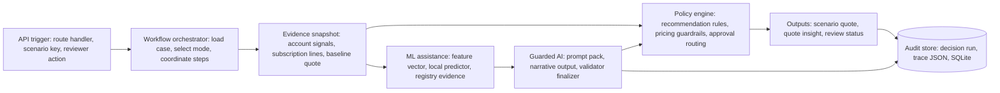

# AI Architecture

## Executive Summary

AI Renewal Quote Copilot is a standalone, local-first renewal decisioning application. It is built to show how enterprise SaaS renewal teams can combine deterministic policy, local open-source ML, local-first LLM support, guarded validators, and human approval into one auditable workflow.

The core design principle is simple:

> Rules determine policy eligibility and guardrails. ML improves risk and expansion evidence. Guarded LLMs can critique or rank candidates only inside validator boundaries. Humans approve quote outcomes.

The app does not rely on an external data warehouse, external model service, or hosted LLM to run the core workflow. Local SQLite data, local Python model artifacts, Ollama-compatible local LLM configuration, and deterministic fallbacks are included for standalone execution.

## Primary Components

| Component | Responsibility |
| --- | --- |
| Next.js App Router | User interface, server-rendered pages, workflow controls, API routes. |
| Prisma + SQLite | Local data model and seeded demo records. |
| Recommendation rules | Deterministic scoring, disposition, pricing posture, and guardrails. |
| Decision orchestrator | Runs rule baseline, ML prediction, final recommendation, and trace creation. |
| Local ML runtime | Builds feature snapshots and returns risk/expansion predictions. |
| Quote insight engine | Converts recommendation outputs into quote-ready actions and evidence. |
| Optional LLM layer | Produces executive summaries, rationale, approval briefs, and guarded shadow/ranking proposals. |
| Guarded validators/finalizers | Validate LLM proposals against supported candidates, evidence references, policy boundaries, and deterministic materialization checks. |
| Decision trace | Stores settings used, rule input, evidence snapshot, ML output, guarded validator/finalizer output, final output, model metadata, and guardrails. |

## Architecture Diagram



## Data Model Inputs

The recommendation and insight calculations use structured renewal data:

- Account: segment, industry, health score, escalation context.
- Product: family, SKU, charge model, pricing context.
- Subscription line: quantity, list price, net price, discount, ARR.
- Usage signals: usage percent of entitlement, active user percent, login trend.
- Support signals: ticket count, Sev1 incidents, CSAT.
- Risk bands: payment risk and adoption band.
- Pricing policy: expansion thresholds, floor price, discount policy, approval triggers.
- Scenario context: base case, adoption decline, expansion upside, customer risk escalation, or other demo scenario.
- Prior workflow state: previous recommendation, existing quote insights, applied quote lines, and review decisions.

All demo data is seeded locally through Prisma. The ML training data is generated locally from the same application data model.

## Recommendation Calculation

Recommendation calculation is handled by the decision orchestrator and recommendation engine.

### Step 1: Build Engine Input

For a renewal case, the app gathers:

- account details
- current renewal items
- latest metric snapshots
- pricing policy
- current quote context
- selected demo scenario

This becomes the deterministic rule input.

### Step 2: Run Rule Baseline

Each renewal line is scored by the rule engine. The rule engine evaluates signals such as:

- usage percent of entitlement
- active user adoption
- login trend
- support ticket volume
- Sev1 incidents
- CSAT
- payment risk
- adoption band
- current discount
- current ARR
- pricing policy

The output for each line includes:

- risk score
- risk level
- drivers
- recommended disposition
- proposed quantity
- recommended discount
- proposed net unit price
- proposed ARR
- approval requirement
- guardrail result

Common line dispositions include:

- `RENEW`
- `EXPAND`
- `RENEW_WITH_CONCESSION`
- `ESCALATE`

### Step 3: Apply Pricing Guardrails

Pricing guardrails are deterministic and remain final in every mode. They control:

- floor price exceptions
- approval requirement
- proposed discount
- proposed net unit price
- proposed ARR
- pricing posture

Even when ML is enabled, ML does not bypass pricing policy.

### Step 4: Build Feature Snapshot

The app builds a versioned feature snapshot for ML:

- feature schema: `renewal-features-v1`
- rule baseline score
- rule disposition
- product and account attributes
- usage/support/commercial metrics
- scenario context

This feature snapshot is stored in the Decision Trace for auditability.

### Step 5: Run Local ML Prediction

If the selected mode enables ML, the app calls the local predictor:

- default path: Next.js invokes `ml/predict.py` as a subprocess
- optional path: Next.js calls `ML_SERVICE_URL/predict`

The prediction payload returns:

- status
- mode
- model name
- model version
- generated timestamp
- bundle risk score
- item predictions
- risk score and probability
- expansion score and probability
- top feature names

### Step 6: Apply Recommendation Mode

The app supports three modes.

| Mode | Calculation Behavior |
| --- | --- |
| Rules Only | Final output equals rule baseline. ML is disabled. |
| Shadow Mode | Rule baseline remains final. ML output is recorded for audit and comparison. |
| ML-Assisted Rules | ML risk can influence item risk scores before final recommendation is recalculated. |

In ML-Assisted Rules mode, item risk is blended:

```text
effective_item_risk = round((0.70 * rule_item_risk) + (0.30 * ml_item_risk))
```

The recommendation engine then reruns using the blended item risk scores. Pricing guardrails are still deterministic and final.

### Step 7: Create Final Bundle Recommendation

The bundle recommendation aggregates item-level results:

- bundle risk score
- bundle risk level
- recommended action
- pricing posture
- approval requirement
- current ARR
- proposed ARR
- ARR delta
- primary drivers
- summary text

The final action is selected conservatively:

1. Escalate if any line requires escalation.
2. Renew with concession if any line requires concession.
3. Expand if any line is expansion-oriented.
4. Otherwise renew as-is.

### Step 8: Apply Guarded LLM Finalizer

Guarded LLM decisioning is controlled separately from recommendation mode.

| Mode | Behavior |
| --- | --- |
| Rules Only | No LLM critique or ranking is used for decision finalization. |
| LLM Critic Shadow | LLM critique is recorded, but final output remains deterministic. |
| LLM Ranking Shadow | LLM ranking is validated and recorded for comparison, but rules remain final. |
| LLM-Assisted Guarded | LLM-ranked candidate can influence the final selected candidate only if deterministic validators pass. |
| Human Approval Required | LLM reasoning supports reviewer workflow while exception posture routes to human approval. |

The validator checks schema, supported candidates, candidate envelope membership, evidence references, policy eligibility, and materialization coherence. Pricing math, approval routing, catalog boundaries, and guardrails remain deterministic.

### Step 9: Store Decision Trace

The Decision Trace records:

- settings used for the run
- run type
- mode
- scenario
- evidence snapshot summary
- candidate envelope and validator result
- rule input summary
- rule output summary
- ML output summary
- guarded LLM shadow/finalizer summary
- final output summary
- guardrail summary
- replay verification result
- model name and version
- rule engine version
- policy version
- feature schema version
- item-level ML predictions

This is the core audit artifact for technical review.

## Local ML Architecture

The local ML bundle lives in `ml/`.

| Task | Active Model | Framework | Purpose |
| --- | --- | --- | --- |
| Renewal risk | `renewal_risk_xgboost` | XGBoost | Predict item-level renewal risk score. |
| Expansion propensity | `expansion_propensity_sklearn` | scikit-learn | Predict expansion propensity for quote insight evidence. |

The model registry is `ml/model-registry.json`. It includes:

- active model version
- model path
- metadata path
- feature schema version
- shadow/hybrid approval flags
- owner
- notes
- artifact SHA-256
- latest evaluation report
- latest metrics

The latest local evaluation report is `ml/reports/evaluation.json`.

Current selection:

- Renewal risk selected by lowest holdout MAE.
- Expansion propensity selected by highest holdout ROC AUC.

Important limitation:

The current training data is synthetic, generated from the app data model. It validates integration, standalone execution, and review readiness. It does not claim production predictive performance.

## Quote Insight Calculation

Quote insights are structured quote actions generated from recommendation output. They are not generated from free-form LLM text.

### Step 1: Read Latest Recommendation Context

The insight engine loads:

- renewal case
- account
- subscription lines
- latest recommendation item results
- latest metric snapshots
- current scenario
- last recommendation JSON
- ML prediction metadata, if available
- existing quote insights

### Step 2: Preserve Applied Quote Actions

Insights already applied to the quote are preserved. The engine avoids regenerating duplicate suggested actions for the same insight type and SKU once an action has been added to the quote.

### Step 3: Build Line-Level Insights

For each renewal item, the engine maps the recommendation disposition to a quote insight type.

Example mappings:

- low-risk renewals become stable renewal or controlled uplift insights
- concession recommendations become retention or strategic concession insights
- expansion recommendations become expansion or cross-sell insights
- escalation recommendations become defensive renewal or governance insights

Each insight includes:

- title
- product name and SKU
- insight type
- status
- confidence score
- fit score
- recommended quantity
- recommended unit price
- recommended discount
- estimated ARR impact
- recommended action summary

### Step 4: Attach Evidence

Each quote insight includes structured justification JSON:

- source type
- insight type
- scenario key
- decision run ID
- engine version
- policy version
- reasoning
- signal snapshot
- commercial delta
- rule hits
- reason codes
- alternatives considered
- objective lens
- ML evidence, when available

ML evidence can include:

- status
- whether ML affected the recommendation
- risk score
- risk probability
- expansion score
- expansion probability
- top features

### Step 5: Score Business Objective

The quote insight engine assigns a primary objective:

- `RETAIN_REVENUE`
- `PROTECT_MARGIN`
- `GROW_ACCOUNT`
- `GOVERN_RISK`

It then calculates an objective score using:

- confidence score
- fit score
- item risk score
- ARR delta
- quantity delta
- scenario context

This gives reviewers a business-oriented reason for the insight, not only a model score.

### Step 6: Generate Additive Insights

The engine may create additive insights for eligible cross-sell or expansion opportunities. These are based on:

- account industry
- account segment
- existing products
- scenario context
- fit and confidence scores

Additive insights are still structured and evidence-backed.

### Step 7: Diff Against Previous Generation

The engine compares previous suggested insights with the new generation:

- added insights
- removed insights
- modified fields

This powers the UI's "what changed" review behavior.

### Step 8: Optional Narrative Generation

The app can generate reviewer-facing text:

- executive summary
- rationale
- approval brief
- quote insight explanation

This layer can run in three ways:

- live OpenAI call when configured
- deterministic mock mode
- deterministic local fallback

Narratives are not the source of pricing truth. They explain structured outputs that were already calculated by rules, ML, and the insight engine.

## Traceability and Governance

The app exposes traceability in several places:

- Decisioning Setup: selected recommendation mode, model readiness, registry status, metrics.
- AI Architecture: model selection, service boundary, artifacts, evaluation.
- Policy Playbook: rules, worked examples, prompt governance.
- Scenario Quote Generation Trace: optional workflow execution, prompt visibility, and decision trace.
- Quote Insights: structured evidence and ML metadata.
- Baseline Quote Review: quote line traceability and final decision.

Prompt governance includes:

- system prompt text
- input template
- current prompt variables
- prompt artifact metadata
- model label or deterministic fallback path

## Production Hardening Path

To move from demo to production, the architecture would need:

- historical labeled renewal outcomes
- time-based validation splits
- tenant-aware data isolation
- model drift and data-quality monitoring
- model promotion workflow
- shadow-mode burn-in dashboards
- reviewer override feedback loop
- explainability with per-prediction contribution values
- access controls and audit log retention
- model rollback and incident handling
- integration with CRM, CPQ, billing, usage, and support systems

## Why This Architecture Is Reviewable

The design is intentionally transparent:

- policy is deterministic and inspectable
- ML is local, versioned, and gated
- hybrid mode is explicit
- guardrails remain final
- prompts are visible
- decision evidence is persisted
- humans approve quote outcomes

That makes the system credible for technical review without overstating what a synthetic demo model can prove.
