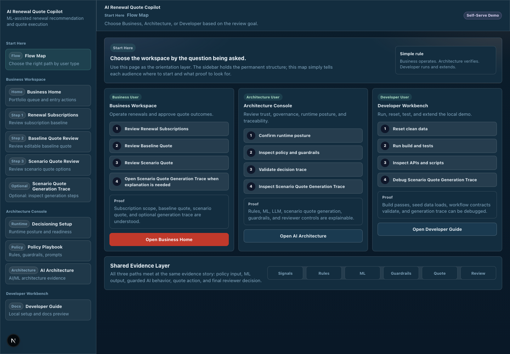
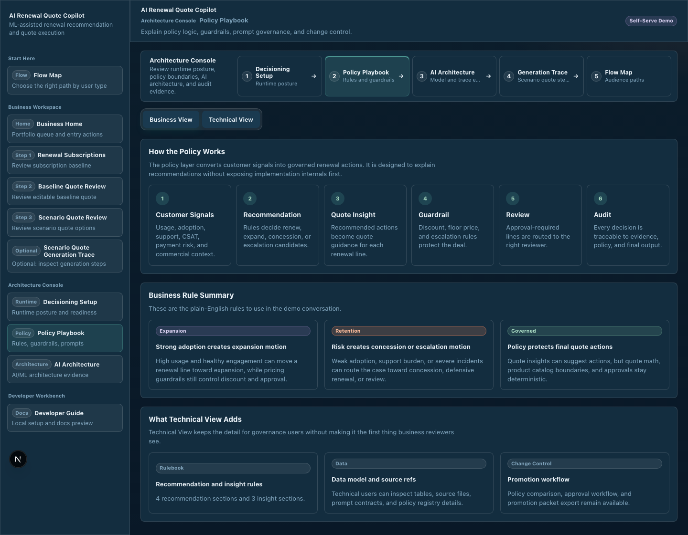
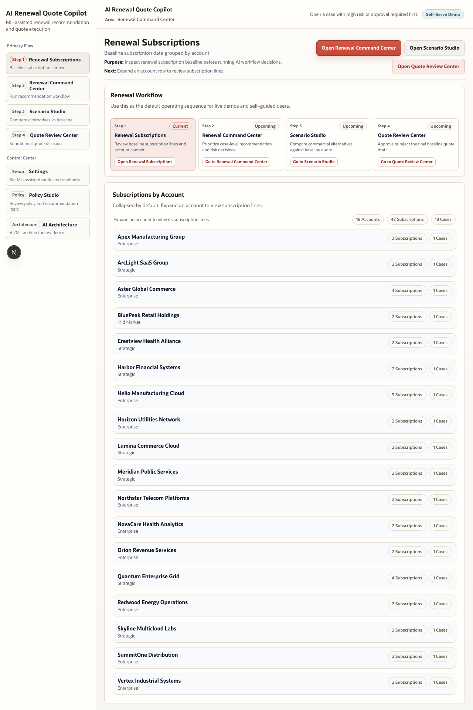
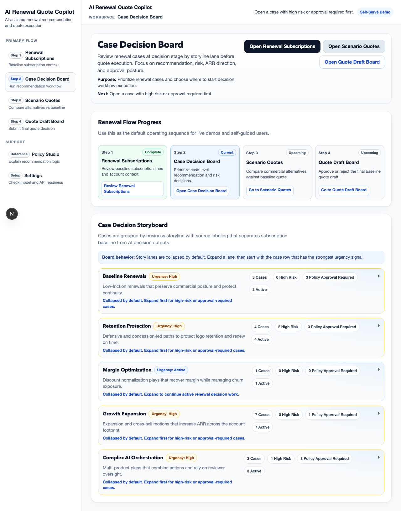
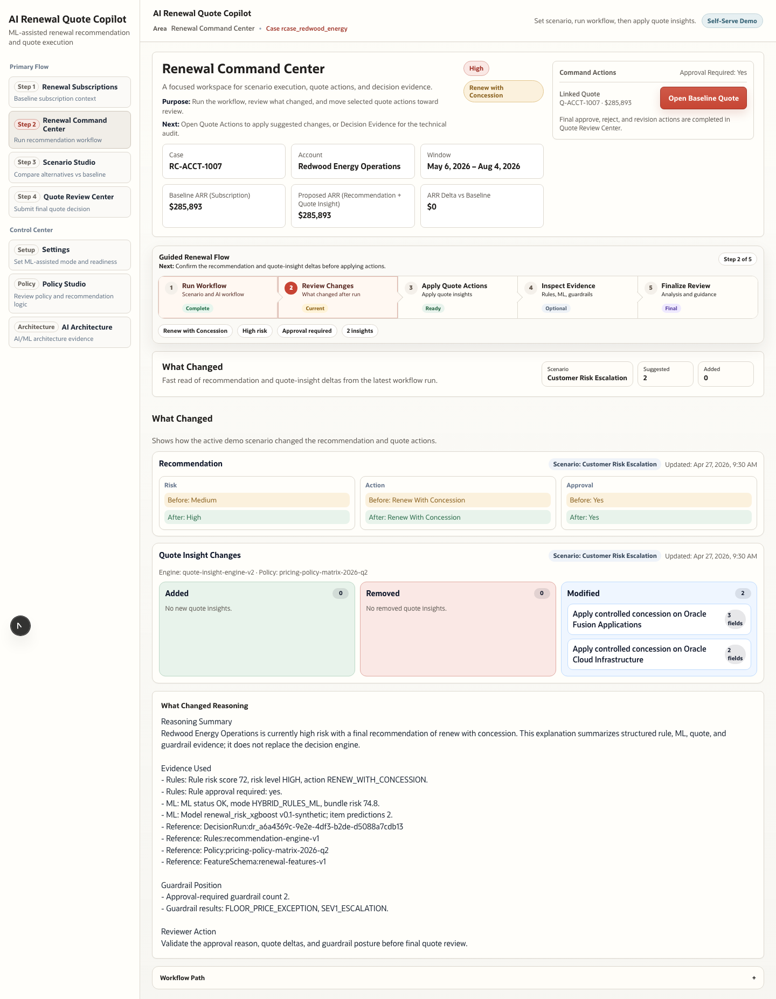
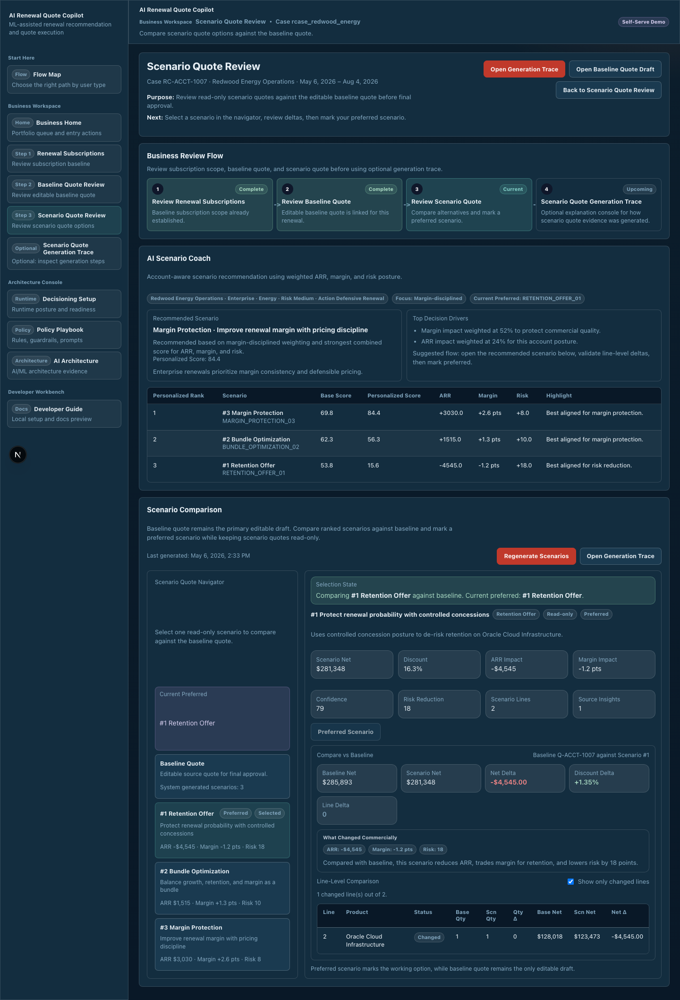
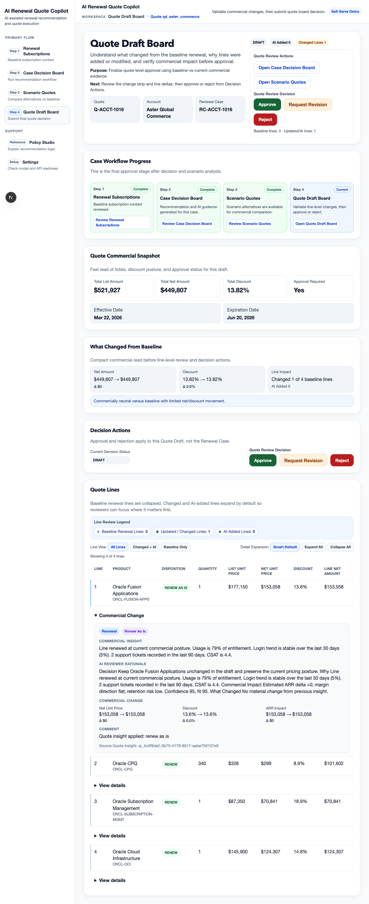

# User Guide: End-to-End Workflow (RC-ACCT-1016)

This guide documents the complete workflow using the seeded reference case:

- Renewal Case Number: `RC-ACCT-1016`
- Renewal Case ID: `rcase_aster_commerce`
- Baseline Quote Number: `Q-ACCT-1016`
- Baseline Quote Draft ID: `qd_aster_commerce`

For a narrated walkthrough, use:

- `docs/demo-recording-runbook-rc-acct-1016.md`

## 1. Start the Application

From the repository root:

```bash
npm install
npm run db:setup
npm run dev
```

Open `http://localhost:3000` (or the fallback port shown in terminal).



## 2. Step 0: Policy Studio (Reference)

Go to `Policy Studio` from the sidebar (`/policies`).

Review:

1. `Seed Data Context` for snapshot coverage and trend mix.
2. `Example Subscription` selector to switch among seeded subscriptions.
3. `Business Interpretation` plus `How the engine works under the hood (business view)`.
4. `Signal Trajectory` to see historical shifts across snapshot dates.
5. `Technical calculation breakdown` (optional) for formula-level traceability.
6. `Prompt Governance` tab:
   - `Current LLM Prompts`
   - exact `System Prompt`
   - current `Input Sent To LLM` template for each AI stage



## 3. Step 1: Renewal Subscriptions

Go to `Renewal Subscriptions` from the sidebar (`/renewal-cases?view=list`).

Actions:

1. Find Aster Commerce account rows.
2. Expand an account to review baseline subscription lines.
3. Confirm this baseline context before decisioning.



## 4. Step 2: Case Decision Board

Go to `Case Decision Board` (`/renewal-cases`).

Actions:

1. Expand relevant storyboard lanes.
2. Find case `RC-ACCT-1016`.
3. Open the case page from the row link.



## 5. Run the Case Workflow for RC-ACCT-1016

Open: `/renewal-cases/rcase_aster_commerce`

In Section A:

1. Keep scenario selection at `BASE_CASE` for first run.
2. Click `Run End-to-End AI Workflow`.
3. Watch `AI Live Run Console`:
   - typed streaming reasoning
   - step-by-step progress
   - workflow summary
4. For any AI step, click `View Prompt Used` to inspect the exact current prompt text.

Then complete:

1. Section B `What Changed`.
2. Section C `Quote Insights` and apply selected actions to the Baseline Quote.
3. If required, click `Regenerate Insights + AI Rationale` to refresh narratives for the latest run.
4. In each Quote Insight card, open `View Prompt Used` to see:
   - exact quote-insight `System Prompt`
   - exact `Input Sent To LLM` generated for that insight



## 6. Step 3: Scenario Quotes

Open: `/scenario-quotes/rcase_aster_commerce`

Actions:

1. Allow the page to auto-generate scenarios on load (default behavior when baseline and insights are ready).
2. Click `Regenerate Quote Scenarios` only if scenarios are stale or you want a fresh run.
3. Select a scenario in `Scenario Quote Navigator`.
4. Review:
   - `What Changed Commercially`
   - line-level comparison vs baseline
5. Click `Mark as Preferred Scenario` if appropriate.

Notes:

- Scenario quotes are read-only compare artifacts.
- Baseline Quote remains the editable quote source.



## 7. Step 4: Quote Draft Board

Open board: `/quote-drafts`

Actions:

1. Find `Q-ACCT-1016` and review the row-level scenario cues next to `Open Scenario Quotes`:
   - `N Scenarios` (generated count)
   - `Refresh Needed` (appears when scenario data is stale)
2. Open quote detail: `/quote-drafts/qd_aster_commerce`.
3. Review `What Changed From Baseline`.
4. Use line filters (`All`, `Changed + AI`, `Baseline Only`) and expansion controls.
5. Use `Decision Actions` to approve/reject/request revision for this quote draft.

Important:

- Decisions are quote-scoped (not subscription-case scoped).



## 8. Verify Completion

After decision:

1. Return to `Case Decision Board` case page and check review history.
2. Confirm quote status on `Quote Draft Board` (`/quote-drafts`).
3. Keep preferred scenario selection for audit context if needed.

## Troubleshooting

- If you see stale-chunk runtime errors:

```bash
rm -rf .next
npm run dev
```

- If data looks unexpected, reseed:

```bash
npm run db:reset:clean
```
