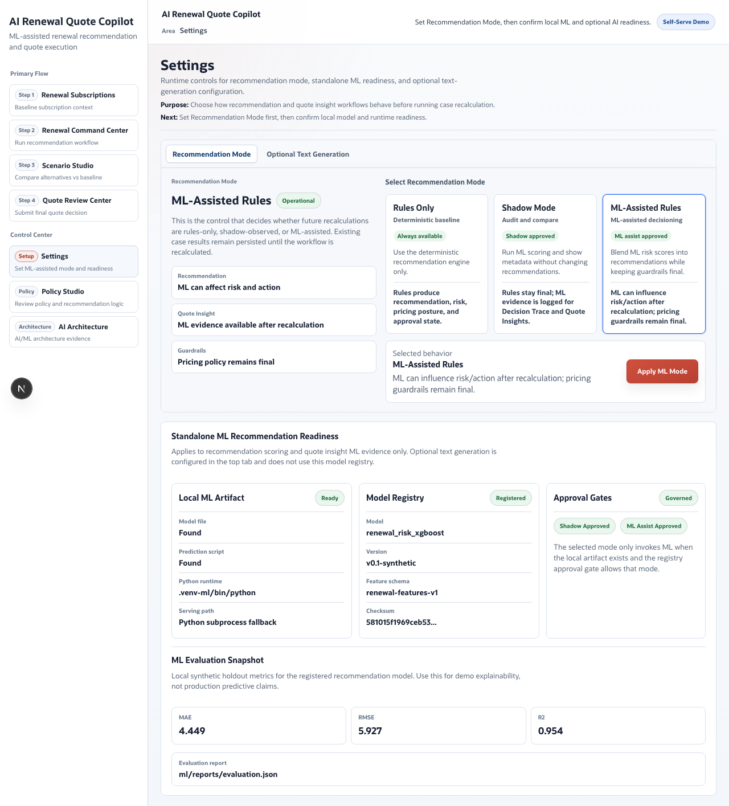
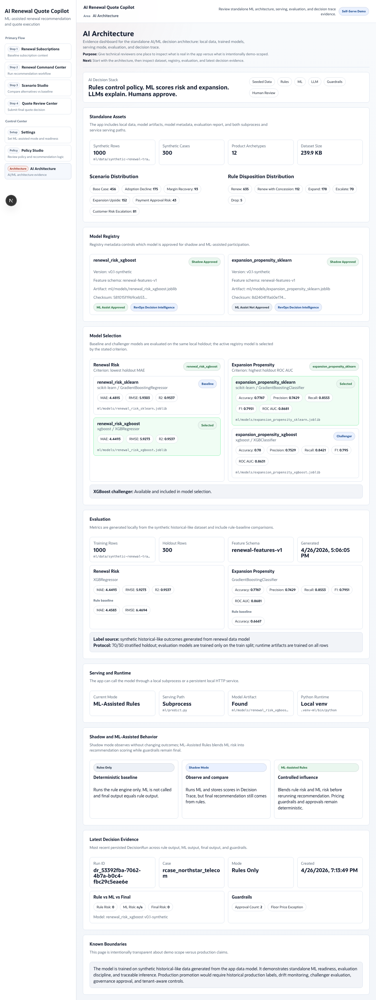

# User Guide: Renewal Workflow

This guide walks through the end-to-end demo workflow with the seeded reference case.

Reference case:

- Account: Aster Commerce
- Renewal Case Number: `RC-ACCT-1016`
- Renewal Case ID: `rcase_aster_commerce`
- Baseline Quote Number: `Q-ACCT-1016`
- Baseline Quote Draft ID: `qd_aster_commerce`

The app is designed to run standalone with local data and local ML artifacts. The default recommendation mode is **ML-Assisted Rules**.

## 1. Start the App

From the repository root:

```bash
npm install
npm run db:setup
make install-ml
npm run ml:generate-data
npm run ml:train
npm run ml:evaluate
npm run dev
```

Open `http://localhost:3000`.

The dashboard gives a high-level entry point into Renewal Subscriptions, Renewal Command Center, Scenario Studio, Quote Review Center, Settings, Policy Studio, and AI Architecture.

The interface is intentionally organized like an operational enterprise console: compact headings, left navigation, visible workflow steps, and direct action controls rather than a marketing-style demo shell.


## 2. Confirm Settings and Recommendation Mode

Open `Settings` from the sidebar.

Use this page before a demo or review to confirm:

1. Recommendation Mode is set to `ML-Assisted Rules`.
2. Local ML artifact is found.
3. Model registry is registered.
4. Shadow and ML-assist approval gates are enabled.
5. Evaluation metrics are visible for the active local model.
6. Optional text generation is configured separately from ML recommendation scoring.

Click `Apply ML Mode` only when changing the selected mode.



## 3. Review AI Architecture

Open `AI Architecture`.

Use this page to explain the AI/ML implementation to a technical audience:

1. Active model registry and artifact status.
2. Model selection across baseline and challenger candidates.
3. XGBoost renewal risk model and sklearn expansion propensity model.
4. Local subprocess prediction or optional service boundary.
5. Evaluation metrics and artifact checksums.
6. Decision trace and prompt governance surfaces.



## 4. Review Policy Studio

Open `Policy Studio`.

This page explains what the app is allowed to do:

1. Recommendation policy and scoring behavior.
2. Quote insight policy and mapping behavior.
3. Worked examples for seeded products and accounts.
4. Journey view for how policy turns into workflow actions.
5. Prompt governance for optional narrative generation.

The important message: deterministic policy and pricing guardrails remain visible even when ML is enabled.


## 5. Review Renewal Subscriptions

Open `Renewal Subscriptions`.

Use this page to inspect the source subscription context before running a case:

1. Account and subscription grouping.
2. Product families and quote context.
3. Baseline quantity, price, discount, and ARR.
4. Usage, support, adoption, payment, and renewal health signals.

For the reference walkthrough, find Aster Commerce.


## 6. Open the Renewal Command Center

Open `Renewal Command Center`.

Renewal Command Center groups renewal cases into decision lanes. Use it to:

1. Find `RC-ACCT-1016`.
2. See recommendation mode cues.
3. Review risk/action/approval posture.
4. Open the renewal case command view.


## 7. Run the Case Workflow

Open:

```text
/renewal-cases/rcase_aster_commerce
```

In Section A:

1. Keep scenario selection at `Base Case` for the first run.
2. Click `Run End-to-End AI Workflow`.
3. Watch the AI Live Run Console progress through:
   - recalculate recommendation
   - generate quote insights and AI rationales
   - generate full AI review guidance
4. Expand `View Prompt Used` when you need prompt transparency.

After the run:

1. Review `What Changed`.
2. Review `Quote Insights`.
3. Open `Structured Evidence` inside an insight to see source, scenario, version, ML status, risk, expansion score, and signal evidence.
4. Apply selected quote insights to the renewal line when appropriate.
5. Review `Decision Trace` for rule input, rule output, ML output, final output, and guardrails.


## 8. Use Scenario Studio

Open `Scenario Studio` from the sidebar first when you want to choose a case from the index.

The index shows:

1. Total renewal cases.
2. Cases with generated scenarios.
3. Total scenario quote count.
4. Approval case count.
5. Per-case scenario count next to `Open Studio`.

Then open:

```text
/scenario-quotes/rcase_aster_commerce
```

Use this page to compare commercial alternatives before editing the baseline quote:

1. Review generated scenario quote candidates.
2. Compare ARR, discount, quantity, and line-level changes.
3. Inspect what changed commercially.
4. Mark a preferred scenario when useful.

Scenarios are read-only comparison artifacts. The baseline quote remains the editable source.


## 9. Review in Quote Review Center

Open:

```text
/quote-drafts/qd_aster_commerce
```

Use Quote Review Center to:

1. Review quote status and approval posture.
2. Compare baseline lines with AI-applied or changed lines.
3. Filter quote lines by all, changed plus AI, and baseline only.
4. Inspect quote traceability and source insight evidence.
5. Approve, reject, or request revision.

Quote decisions are quote-scoped, not case-scoped.


## 10. Verify Completion

After quote review:

1. Return to Renewal Command Center and review history.
2. Return to Quote Review Center and confirm quote status.
3. Keep the preferred scenario selection for audit context if it was used.
4. Use Decision Trace to explain why the final recommendation changed or stayed the same.

## Recommended Technical Demo Flow

For a VP engineering or architecture review:

1. Start at `Settings` and show ML-Assisted Rules.
2. Open `AI Architecture` and show model selection plus local artifacts.
3. Open `Policy Studio` and show rule/guardrail transparency.
4. Run the case workflow.
5. Open Decision Trace and explain rule baseline vs ML output vs final output.
6. Open Quote Insight structured evidence and show ML metadata.
7. Open Quote Review Center and show the human approval endpoint.

## Troubleshooting

If a stale chunk error appears after a production build:

```bash
rm -rf .next
npm run dev
```

If seeded data needs to be rebuilt:

```bash
npm run db:reset:clean
```

If ML readiness is missing:

```bash
make install-ml
npm run ml:generate-data
npm run ml:train
npm run ml:evaluate
```
